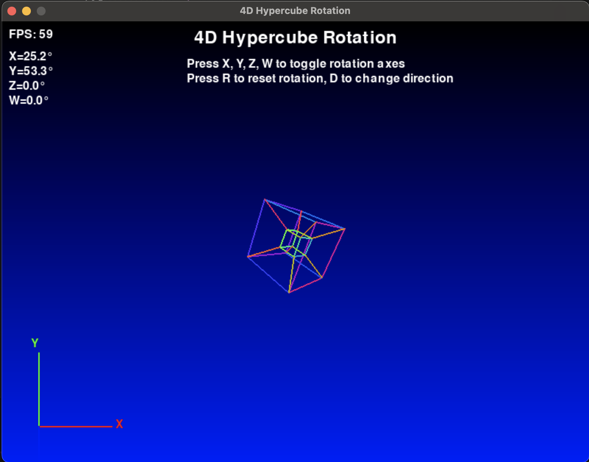

# 4D Hypercube Visualization


This project provides a simple visualization of a 4D hypercube (also known as a tesseract) using Pygame. The visualization demonstrates the projection of a 4D object into 3D space and then into 2D space for display on a screen.

## Visualization Concept

The visualization works by projecting the 4D hypercube vertices into 3D space and then further projecting these 3D points into 2D space. This allows us to visualize the complex structure of a 4D object on a 2D screen.

### Projection Steps

1. **4D to 3D Projection**: Each vertex of the 4D hypercube is projected into 3D space using a perspective projection. This involves dividing the x, y, and z coordinates by a factor that depends on the w coordinate.
2. **3D to 2D Projection**: The resulting 3D points are then projected onto the 2D screen using another perspective projection, which involves dividing the x and y coordinates by a factor that depends on the z coordinate.

#### Rotation around the W-axis:

The rotation matrix for the W-axis is used to rotate points in the 4D space around the W-axis. This matrix affects the Z and W coordinates of the points. The matrix is defined as:

1  0  0  0  
0  1  0  0  
0  0  cos(θ)  -sin(θ)  
0  0  sin(θ)  cos(θ)  

Where θ is the angle of rotation. This matrix keeps the X and Y coordinates unchanged while rotating the Z and W coordinates.

## Usage

### Controls

- **Toggle Rotation Axes**: Press `X`, `Y`, `Z`, or `W` to toggle rotation around the respective axis.
- **Reset Rotation**: Press `R` to reset all rotation angles to zero.
- **Change Rotation Direction**: Press `D` to toggle the direction of rotation for all axes.

## Running the Application
This project uses uv for dependency management. So if you don´t already have, install `uv` first by calling
```bash
pip install uv
```
first.
Than simply run
```bash
uv run main.py
```
inside the project folder, which will create a virtual environment and install all required dependencies automatically and finally run the application.


## Contributing

This project is open for contributions! If you have ideas to enhance the visualization or add new features, feel free to fork the repository and submit a pull request. Let's grow in creativity together!

